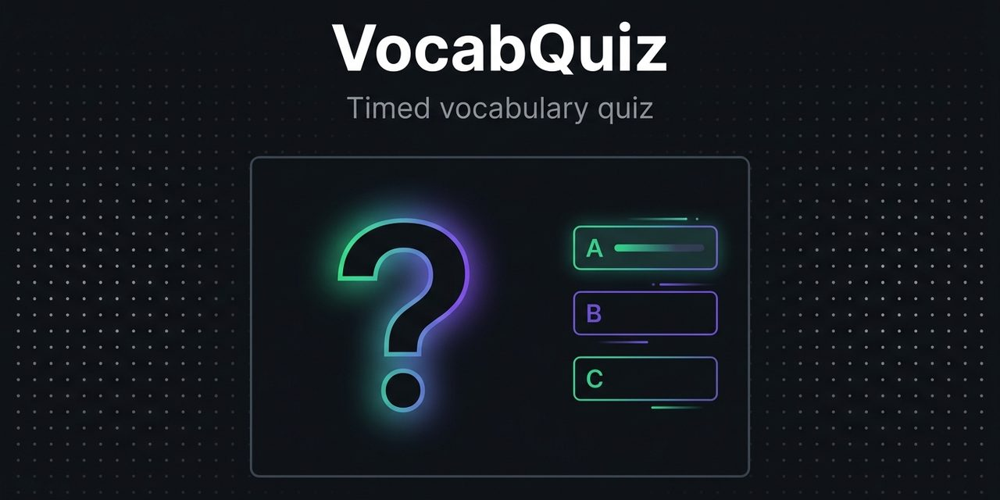

# VocabQuiz

[](LICENSE)
[]()
[]()

A broadcast vocabulary quiz for English-learning servers. Every 10 minutes
the server announces a theme (animals, food, weather, colors and more),
each player gets a personal question, and the first correct answer within
30 seconds pays out.

<p align="center">
  
</p>

## Why this plugin exists

Passive vocabulary is useless in chat. A quiz that interrupts the game
every few minutes makes players recall words on a timer, which is closer to
real conversation than reading a word list.

## Features

- Quiz every 10 minutes, 30 seconds to answer, 60 second player cooldown
- 8 themes that cycle daily: animals, food, weather, colors, clothes, body, family, school
- Questions filtered by the player's English level (LuckPerms track `english`), so A0 players get A0 words
- $5.00 reward per correct answer (configurable)

## Requirements

- Paper or Spigot 1.21+
- Vault with an economy plugin
- Optional: LuckPerms for level-filtered questions

## Commands

```
/answer <word>         answer the current question
/vocabquiz join        join the current quiz
/vocabquiz skip        skip this round
/vocabquiz theme       show the current theme
/vocabquiz reload      reload config
```

## Install

1. Put `VocabQuiz.jar` in `plugins/`.
2. Copy `config.example.yml` to `config.yml`.
3. Restart the server.

## Configuration

```yaml
quiz:
  interval-minutes: 10
  answer-timeout-seconds: 30
  cooldown-seconds: 60

rewards:
  correct-answer: 5.0

themes:
  mode: daily-cycle
  list: [animals, food, weather, colors, clothes, body, family, school]

levels:
  enabled: true
  track: english
  default: a0
```

## License

MIT. See [LICENSE](LICENSE).
